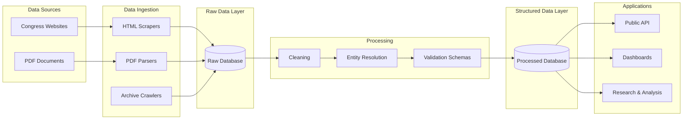

# OpenCongress

OpenCongress is an open source civic technology project that transforms fragmented and unstructured legislative information from the Peruvian Congress into structured, machine readable data.

Its goal is to lower the cost of understanding how Congress works: who proposes laws, how representatives vote, how parties behave, and how legislation evolves. By converting difficult-to-use documents into structured datasets, OpenPeru makes political accountability more feasible for citizens, journalists, researchers, and civil society organizations.

Peru has experienced years of political instability and weak political parties, making transparency and accountability especially important. Although the Peruvian Congress publishes large amounts of information such as bills, voting records, and official documents, this data is often scattered across different websites and released in formats that are difficult to search, analyze, or reuse.

OpenCongress helps solve this problem by turning complex and fragmented congressional information into structured data that is easier to explore, analyze, and understand. Rather than creating new political information, the project unlocks the value of data that already exists but is currently difficult to access.

## What OpenCongress Provides

At its current stage, OpenPeru focuses on the legislative core of Congress and integrates data across multiple dimensions:

- **Bills and motions**: proposals, authorship, legislative status, and procedural steps
- **Voting records and attendance**: individual‑level and aggregate vote outcomes
- **Congress members (congresistas)**: identities, party affiliations, and memberships over time
- **Political organizations**: parties, parliamentary groups, and committees
- **Legislative processes**: structured representations of how initiatives evolve

All information is stored in relational databases designed for analysis, reuse, and future API access.

## Architecture Overview

OpenCongress follows a layered architecture that separates data collection, storage, processing, and analysis. This keeps raw data reproducible while producing clean datasets for research and applications.



### 1. Data Acquisition (Scrapers)

Custom scrapers collect legislative data directly from Congress websites.
They handle HTML pages, PDFs, and historical archives while remaining resilient to format changes.

### 2. Raw Data Layer

All scraped content is stored in a **raw database** that closely mirrors the source documents. This preserves the original data and allows re-processing when parsing improves.

### 3. Processing and Standardization

Raw records are cleaned and standardized into structured entities.
This includes normalization, entity resolution, and schema validation.

### 4. Processed Data Layer

Clean outputs are stored in a processed database optimized for querying and analysis.

### 5. Testing and Reliability

Automated tests cover scrapers, database models, and processing logic to detect changes in Congress data sources.

---

## Tools and Technologies

- **Python** as the core language
- **SQLAlchemy** for database modeling and persistence
- **SQLite** for raw and processed storage (with a design compatible with future scaling)
- **Pydantic‑style schemas** for validation and consistency checks
- **Selenium and HTTP‑based scraping utilities** for dynamic and static sources
- **Pytest** for automated testing
- **Structured logging** for scraper and pipeline diagnostics

The architecture is intentionally modular to support future extensions such as APIs, dashboards, and machine‑learning pipelines.

---

## Repository Structure (High Level)

The repository is organized into modular components for data collection, processing, and testing:

```
openperu/
├── backend/
│   ├── api/            # Future API layer
│   ├── cli/            # Command line interface for pipelines
│   ├── core/           # Shared configuration, utilities, logging
│   ├── database/       # Raw and processed database models
│   ├── documents/      # Downloaded congressional documents
│   ├── process/        # Data cleaning and standardization
│   └── scrapers/       # Data collection from Congress websites
│
├── data/
│   ├── raw/            # Raw scraped data - Not available in GitHub
│   └── processed/      # Clean structured datasets - Not available in GitHub
│
├── draft_notebooks/    # Exploration and experimentation
├── logs/               # Pipeline and scraper logs
└── tests/
    ├── database/       # Tests for database models
    ├── process/        # Data processing tests
    └── scrapers/       # Scraper tests
```

Each major submodule includes its own README with more detailed documentation.

---

## Project Status and Roadmap

OpenCongress is under active development. Current priorities include:

- Expanding coverage of voting and attendance records
- Improving historical consistency across legislative periods
- Exposing a public data API
- Building analytical summaries and visualizations

Contributions and feedback are welcome.

---

## License

This project is released under an open-source license. See the `LICENSE` file for details.

