# Architecture Overview 

OpenPeru follows a layered architecture that separates data collection, storage, processing, and analysis. This keeps raw data reproducible while producing clean datasets for research and applications.

## Architecture
Our system is organized into clear layers so that scraping, transformation, storage, and product features remain decoupled.

OpenCongress uses a **two-layer database design** with separate schemas:

- **Raw layer** stores scraped congressional data exactly as collected, preserving source history and allowing recovery from source changes or improved parsers without re-scraping.
- **Processed layer** contains normalized relational models used by APIs, analytics, and downstream features.

To support efficient updates, raw models include metadata fields such as `timestamp`, `last_update`, `changed`, and `processed`. These flags allow the pipeline to detect new or modified records and reprocess only those records, rather than rebuilding the full processed database after every scraper run.

For more details, see [Data Model](./data_model.md).

#### System Architecture

<!-- ```mermaid
---
config:
  layout: elk
---
flowchart LR
    %% Subgraph: Sources
    subgraph Sources["Original Sources"]
        class Sources sources;
        A1["Congress Websites"]
        A2["PDF Documents"]
        A3["Congress YouTube Channel"]
    end

    %% Subgraph: Data Ingestion
    subgraph Ingestion["Data Ingestion"]
        class Ingestion ingestion;
        B1["Web Scrapers"]
        B2["Video Scrapers"]
    end

    %% Subgraph: Raw Data Layer
    subgraph Raw["Raw Data Layer"]
        class Raw raw;
        C1[("Raw Database")]
    end

    %% Subgraph: Processing (and its subsystems)
    subgraph Processing["Processing"]
        class Processing processing;

        subgraph OCR["OCR Extraction"]
            class OCR processing;
            D1["Cleaning"]
            D2["Entity Resolution"]
            D3["Validation Schemas"]
        end

        subgraph JSON["JSON Parsing"]
            class JSON processing;
            D4["Cleaning"]
            D5["Entity Resolution"]
            D6["Validation Schemas"]
        end

        subgraph HTML["HTML/XML Parsing"]
            class HTML processing;
            D7["Cleaning"]
            D8["Entity Resolution"]
            D9["Validation Schemas"]
        end
    end

    %% Subgraph: Structured / Processed Data
    subgraph Processed["Structured Data Layer"]
        class Processed processed;
        E1[("Processed Database")]
    end

    %% Subgraph: AI Data Analysis
    subgraph AI["Data Analysis"]
        class AI analysis;
        G1["Summarization"]
        G2["Bill Differences"]
    end

    %% Subgraph: Frontend
    subgraph Frontend["Frontend"]
        class Frontend frontend;
        F1["Public API"]
        F2["Web Application"]
    end

    %% Relationships
    Sources -- > Ingestion
    B1 -- > C1
    B2 -- > C1
    C1 -- > OCR
    C1 -- > JSON
    C1 -- > HTML
    OCR -- > Processed
    JSON -- > Processed
    HTML -- > Processed
    AI -- > Processed
    Processed -- > AI
    Processed -- > Frontend

    %% Styles
    classDef sources stroke:indigo,fill:#eef2ff;
    classDef ingestion stroke:teal,fill:#f0fdfa;
    classDef raw stroke:violet,fill:#f5f3ff;
    classDef processing stroke:orange,fill:#fff7ed;
    classDef processed stroke:green,fill:#f0fdf4;
    classDef analysis stroke:cyan,fill:#ecfeff;
    classDef frontend stroke:fuchsia,fill:#fdf4ff;
``` -->

### Data Ingestion and Raw Data Layer

Given that the data sources come in different formats and are updated at different intervals, we have built a data ingestion module that takes into account the unique specifications of each source and stores the extracted information as is. the data ingestion module allows us to handle HTML pages, internal APIs from the Congress website, PDFs linked to each step in the legislative process, and other historical archives while remaining resilient to format changes to the website.

As a result, all scraped content is stored in a **raw database** that closely mirrors the source documents. This preserves the original data and allows re-processing when parsing improves.


<!-- 
```mermaid
---
config:
  layout: elk
---
flowchart LR
 subgraph O["Original Sources"]
        n0["Congress Website"]
  end
 subgraph s11["MetadataScrapers"]
        n3a["bancadas.py"]
        n3b["bills.py"]
        n3d["committees.py"]
        n3e["congresitas.py"]
        n3f["leyes.py"]
        n3g["motions.py"]
        n3i["organizations.py"]
  end
 subgraph s12["DocumentScrapers"]
        n3c["bills_documents.py"]
        n3h["motions_documents.py"]
  end
 subgraph s1["Scrapers"]
        s11
        s12
  end
 subgraph s3a["manage"]
        n5a["build_db.py"]
        n5c["orchestrator.py"]
        n5e["session.py"]
  end
 subgraph s3b["models"]
        n5d["raw_models.py"]
  end
 subgraph s3["Database"]
        s3a
        s3b
  end
 subgraph s4["Documents"]
        n6["Document Storage"]
  end
 subgraph S["Databases"]
        n1[("RawDB")]
  end
    O -- > s11
    n1 -- > s12
    s11 -- > s3a
    s12 -- > s3a
    n5d -- > s3a
    s3a -- > s4 & n1
    s3a -- > n1
```
 -->


### Processing and Processed Data Layer

The processing module uses the raw data layer to process each core entity based on its specific structure. In that sense, depending on the type of scraped data, we have implemented differentiated pipeline extractions.

- HTML/XML data sources: We used `lxml` for parsing HTML and XML responses from the Congress website. / xpath and css_selector
- JSON API Responses: We used `json` and `python`'s built-ins to parse JSON type responses from the Congress website.
- PDF Documents: We used `pytesseract`, `pymupdf`, and `opencv-python` to build a text extraction pipeline from scanned PDF pages.

All the processing scripts are then routed into the **processed database** to its correspondent tables by using SQLAlchemy ORM and a `Pydantic` schema validation layer.



<!-- ```mermaid
---
config:
  layout: elk
---
flowchart LR
 subgraph s2a["Core Entities"]
        n4a["attendance.py"]
        n4b["bancadas.py"]
        n4c["bills.py"]
        n4d["congresitas.py"]
        n4e["leyes.py"]
        n4f["motions.py"]
        n4g["organizations.py"]
        n4j["votes.py"]
  end
 subgraph s2b["Utils"]
        n4h["ocr_extraction.py"]
        n4i["schema.py"]
        n4k["utils.py"]
  end
 subgraph s2["Process"]
        s2a
        s2b
  end
 subgraph n5f["crud"]
        n5f1["pipeline_bills.py"]
        n5f2["pipeline_motions.py"]
        n5f3["pipeline_core.py"]
  end
 subgraph n5g["models"]
        n5b["models.py"]
        n5d["raw_models.py"]
  end
 subgraph n5h["manage"]
        n5a["build_db.py"]
        n5c["orchestrator.py"]
        n5e["session.py"]
  end
 subgraph s3["Database"]
        n5f
        n5g
        n5h
  end
 subgraph s4["Documents"]
        n6["Documents Storage"]
  end
 subgraph S["Databases"]
        n1["RawDB"]
        n2["CleanDB"]
  end
    s2b -- > s2a
    n1 -- > n6 & s2a
    s4 -- > s2a
    n5f -- > n5h
    s2a -- > n5h
    n5g -- > n5h
    n5h -- > n2 & n2

    n1@{ shape: db}
    n2@{ shape: db}
    ``` -->

### AI Features and Data Analysis
After the processing data layer, we already have the core entities for our system. However, there are a few features that require to add new processing layers on top of these entities. For instance, we are currently implementing two features:
- Bill process summarization: 
- Bill Difference Tracker: 


### Frontend
